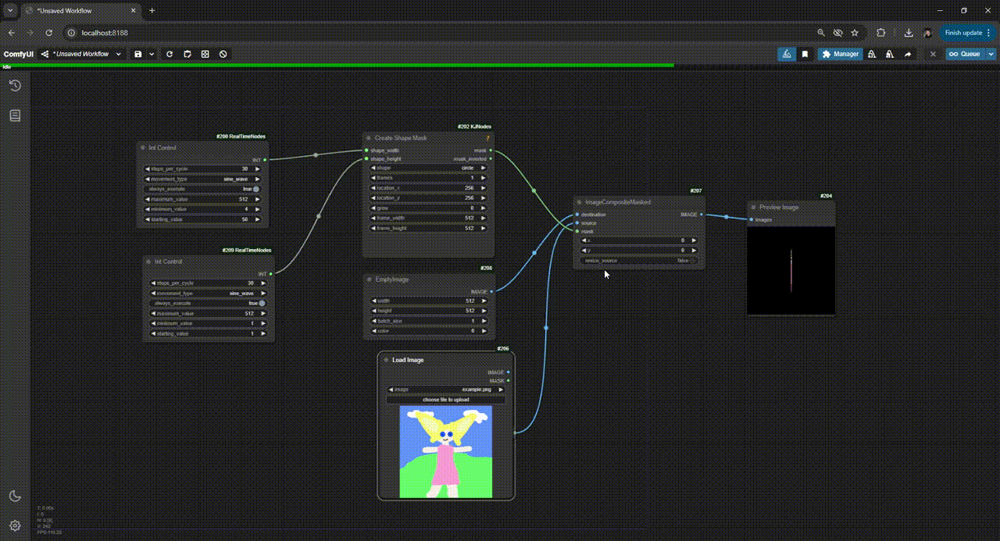

# ComfyUI Control Nodes

Simple control nodes that generate changing values over separate executions of a workflow. Each time the workflow is executed, the value will be updated. This is useful for animating parameters in systems like [ComfyStream](https://github.com/yondonfu/comfystream) that execute the workflow once per frame.

## Nodes

### Value Controls
- **FloatControl**: Outputs a floating point value that changes over time using various patterns (sine wave, bounce, random walk, etc).
- **IntControl**: Same as FloatControl but outputs integer values.
- **StringControl**: Cycles through a list of strings using the same movement patterns.

### Sequence Controls
- **FloatSequence**: Cycles through a comma-separated list of float values.
- **IntSequence**: Cycles through a comma-separated list of integer values.
- **StringSequence**: Cycles through a list of strings (one per line).

### Utility Controls
- **FPSMonitor**: Generates an FPS overlay as an image and mask, useful for monitoring performance.

## Usage

### Value Controls
Connect any value control node to the input of the node you want to animate. These nodes use movement patterns like sine, bounce, etc. to smoothly transition between values.

### Sequence Controls
Sequence controls allow you to specify exact values to cycle through. You can control:
- Steps per item: How many frames to show each value
- Sequence mode: forward, reverse, pingpong, or random

### FPS Monitor
Outputs an image and mask showing current and average FPS. Useful for performance monitoring in real-time workflows.

IMPORTANT: Be sure to set viable minimum and maximum values according to the node you are animating.

## Demo
In this demo we are controlling the width and height of a shape mask with an Int Control node. Imagine controlling the denoise on a KSampler with a Float Control, though!


## Installation

### Option 1: ComfyUI Manager (Coming soon!!)
~~The easiest way to install is through [ComfyUI Manager](https://github.com/ltdrdata/ComfyUI-Manager):~~
~~1. Install ComfyUI Manager if you haven't already~~
~~2. Open ComfyUI~~
~~3. Navigate to the Manager tab~~
~~4. Search for "Control Nodes"~~
~~5. Click Install~~

### Option 2: Manual Installation
1. Clone this repository into your ComfyUI custom_nodes folder:
```bash
cd ComfyUI/custom_nodes
git clone https://github.com/your-repo/comfyui-control-nodes.git
```

2. Install the required dependencies:
```bash
pip install -r requirements.txt
```